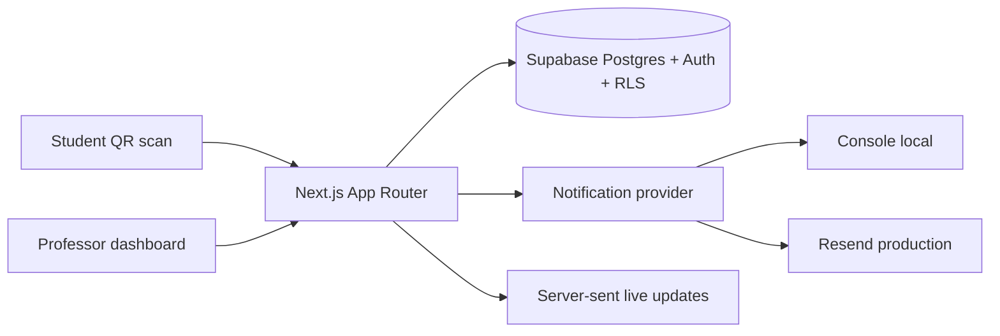

# Office Hours Queue v0.1.0

A real web application for college professors, instructors, and teaching assistants to manage office-hour appointments, live walk-in queues, QR-code student access, operational notifications, and aggregate analytics.

The working name is intentionally easy to change. The app name comes from `NEXT_PUBLIC_APP_NAME`.

## Problem

Office hours often become a messy mix of walk-ins, email requests, appointment links, students waiting outside an office, no-shows, and repeated professor emails. Office Hours Queue gives a professor one stable QR link that students can scan to book a slot, join a live queue, check their position, and receive simple status notifications.

## v0.1 workflow

1. Professor creates a term such as **Fall 2026**.
2. Professor creates **WGST 101: Introduction to Women's and Gender Studies**.
3. Professor creates recurring Tuesday 2:00–4:00 PM office hours.
4. The system generates a stable QR/link.
5. A student scans the QR code.
6. The student books an appointment or joins the live queue.
7. The student receives a private status link.
8. The professor sees the student on the live dashboard.
9. The student sees position, estimated wait, and status updates.
10. The professor can call next, mark ready, start, complete, mark late, or mark no-show.
11. The analytics dashboard shows aggregate semester-ready statistics.

## Screenshots

Screenshots are intentionally placeholders in v0.1. Run the app locally and capture:

- Professor dashboard
- Course QR page
- Student course page
- Student status page
- Live queue dashboard
- Analytics page

## Architecture



See [`docs/ARCHITECTURE.md`](docs/ARCHITECTURE.md) for the detailed architecture and state machines.

## Technology stack

- TypeScript
- React
- Next.js App Router
- Tailwind CSS
- Supabase Postgres
- Supabase Auth
- Supabase Row Level Security
- Server-sent events for v0.1 live updates
- QR code generation with `qrcode`
- Recharts-ready analytics stack
- Resend-ready transactional email abstraction
- Vitest tests
- GitHub Actions CI

## Features included

### Professor

- Supabase Auth sign-in
- Terms/semesters
- Courses
- Default topic categories
- Course-specific QR code
- Stable student course URL
- Tuesday 2–4 demo office-hours generator
- Appointment slots
- Active live queue session
- Live professor queue dashboard
- Pause/resume queue
- Call next
- Mark ready
- Start meeting
- Complete meeting
- Mark late/no-show
- Move student down
- Remove from queue
- Running 10/20 minutes late notices
- Aggregate analytics
- CSV export

### Student

- No traditional student account required
- Mobile-first QR flow
- Book appointment
- Join live queue
- Opening-alert subscription page
- Private status page
- Position and estimated wait
- On-my-way action
- Check-in action
- Leave queue
- Cancel appointment
- Browser notification progressive enhancement

### Security and privacy

- RLS policies for professor-owned data
- Server-only service-role access
- Unguessable student status tokens
- No SMS in v0.1
- No continuous GPS tracking
- No grades, medical information, disability information, or unnecessary sensitive data requested
- Aggregate-safe CSV export

See [`docs/SECURITY.md`](docs/SECURITY.md).

## Windows setup

### 1. Install Node.js

Use Node.js 20.19.4 or newer. Node 22 LTS is fine.

PowerShell check:

```powershell
node -v
npm -v
```

If Node is too old, install the current LTS from Node.js or use `nvm-windows`.

### 2. Extract the ZIP

Extract this project somewhere like:

```powershell
E:\JOEPAK\office-hours-queue-v0.1.0
```

Then open it:

```powershell
cd "E:\JOEPAK\office-hours-queue-v0.1.0"
code .
```

### 3. Install dependencies

```powershell
npm install
```

### 4. Create a Supabase project

1. Go to Supabase and create a new project.
2. Copy the Project URL.
3. Copy the anon public key.
4. Copy the service role key. Keep this secret.
5. In Supabase SQL Editor, run:
   - `supabase/migrations/0001_initial_schema.sql`
   - `supabase/migrations/0002_security_policies.sql`

### 5. Create `.env.local`

```powershell
Copy-Item .env.example .env.local
notepad .env.local
```

Fill in:

```env
NEXT_PUBLIC_APP_NAME="Office Hours Queue"
NEXT_PUBLIC_APP_URL="http://localhost:3000"
NEXT_PUBLIC_SUPABASE_URL="https://YOUR_PROJECT.supabase.co"
NEXT_PUBLIC_SUPABASE_ANON_KEY="YOUR_SUPABASE_ANON_KEY"
SUPABASE_SERVICE_ROLE_KEY="YOUR_SERVICE_ROLE_KEY"
NOTIFICATION_PROVIDER="console"
DEMO_PROFESSOR_EMAIL="demo.professor@example.com"
DEMO_PROFESSOR_PASSWORD="OfficeHoursDemo123!"
DEMO_PROFESSOR_NAME="Professor Minji Kang"
```

### 6. Seed demo data

```powershell
npm run db:seed
```

This creates the demo professor, Fall 2026, WGST 101, WGST 302, appointment slots, an active live queue, and fictional demo students.

### 7. Start development

```powershell
npm run dev
```

Or double-click:

```powershell
.\run-dev.bat
```

Open:

```text
http://localhost:3000
```

### 8. Log in as demo professor

Use whatever you put in `.env.local`, default:

```text
Email: demo.professor@example.com
Password: OfficeHoursDemo123!
```

### 9. Generate and use the QR code

1. Go to Dashboard → Courses.
2. Open WGST 101.
3. The QR card shows a stable student URL.
4. Download the PNG or copy the URL.
5. Open the student URL in another browser or incognito window to simulate a student.

### 10. Simulate a student joining

1. Open the student course page.
2. Choose **Join today's queue**.
3. Enter fictional student info.
4. Submit.
5. The private status page should show position, people ahead, approximate wait, and buttons.
6. In the professor dashboard, open the active live session and call next.

### 11. Test notifications

For local development, notifications are printed in the terminal because:

```env
NOTIFICATION_PROVIDER="console"
```

To test real email later:

```env
NOTIFICATION_PROVIDER="resend"
RESEND_API_KEY="re_..."
NOTIFICATION_FROM_EMAIL="Office Hours Queue <notifications@yourdomain.com>"
```

### 12. View analytics

Go to:

```text
http://localhost:3000/dashboard/analytics
```

Export CSV with the **Export CSV** button.

### 13. Run tests

```powershell
npm run test
```

Or:

```powershell
.\run-tests.bat
```

A dependency-free smoke test is also included:

```powershell
npm run test:smoke
```

### 14. Build production

```powershell
npm run build
```

Or:

```powershell
.\run-build.bat
```

### 15. Create the GitHub repository and first commit

```powershell
git init
git branch -M main
git add .
git commit -m "Build Office Hours Queue v0.1.0"
```

Then create a GitHub repo and push:

```powershell
git remote add origin https://github.com/YOUR_USERNAME/office-hours-queue.git
git push -u origin main
```

## Environment variables

| Name | Required | Purpose |
| --- | --- | --- |
| `NEXT_PUBLIC_APP_NAME` | yes | Branding name shown in the app |
| `NEXT_PUBLIC_APP_URL` | yes | Local or deployed app URL |
| `NEXT_PUBLIC_SUPABASE_URL` | yes | Supabase project URL |
| `NEXT_PUBLIC_SUPABASE_ANON_KEY` | yes | Browser-safe Supabase anon key |
| `SUPABASE_SERVICE_ROLE_KEY` | yes for student flows | Server-only key for secure public actions |
| `NOTIFICATION_PROVIDER` | yes | `console` or `resend` |
| `RESEND_API_KEY` | only for Resend | Transactional email API key |
| `NOTIFICATION_FROM_EMAIL` | only for email | Verified sender |

## Current limitations

This is a real v0.1, not a production-certified institutional platform yet.

Known limitations:

- Reminder scheduling is a script, not a hosted cron job.
- Opening-alert notifications have the data model and subscription page, but need fuller claim-window UI.
- Waitlist has the data model and documented flow, but the UI is minimal.
- SSE updates are intentionally simple and can later be replaced with Supabase Realtime channels.
- Department admin, SSO, Canvas, SMS, native mobile apps, payments, and calendar sync are roadmap items.

## Documentation

- [`docs/ARCHITECTURE.md`](docs/ARCHITECTURE.md)
- [`docs/DATABASE.md`](docs/DATABASE.md)
- [`docs/SECURITY.md`](docs/SECURITY.md)
- [`docs/NOTIFICATIONS.md`](docs/NOTIFICATIONS.md)
- [`docs/ANALYTICS.md`](docs/ANALYTICS.md)
- [`docs/DEPLOYMENT.md`](docs/DEPLOYMENT.md)
- [`docs/ROADMAP.md`](docs/ROADMAP.md)
- [`docs/EDGE_CASES.md`](docs/EDGE_CASES.md)
- [`docs/SECURITY_TESTS.md`](docs/SECURITY_TESTS.md)
- [`BUILD_REPORT.md`](BUILD_REPORT.md)

## Product principle

This should not feel like another giant LMS.

It should answer:

> How can a professor manage office hours with almost zero administrative friction?
