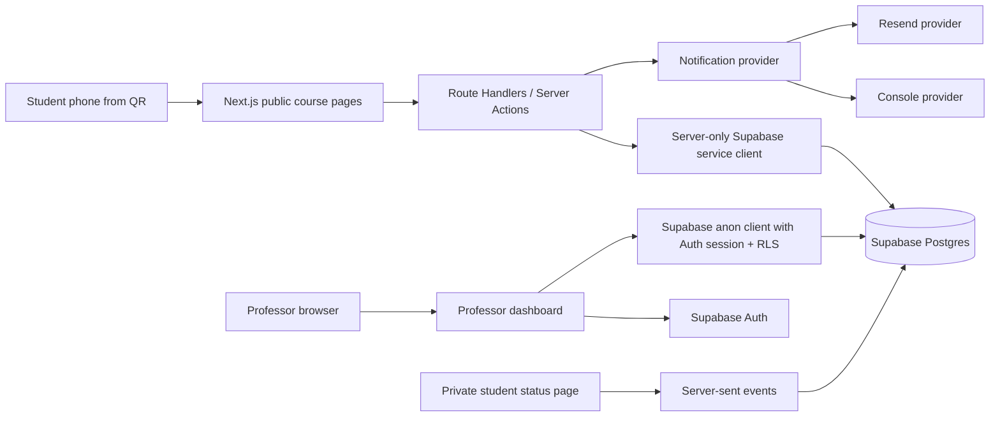
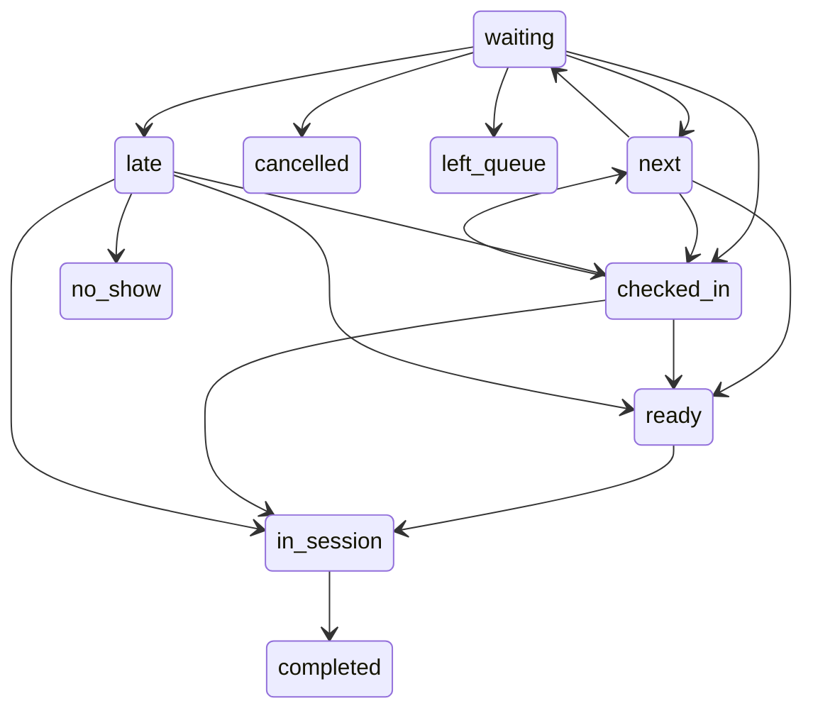
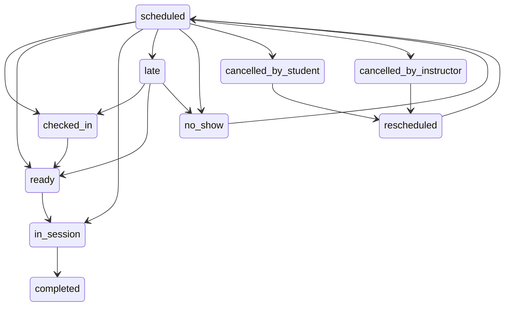

# Architecture

Office Hours Queue v0.1.0 is a mobile-first Next.js web app backed by Supabase Postgres, Supabase Auth, Row Level Security, and a server-side notification abstraction.

## Main design choices

- Professors authenticate with Supabase Auth.
- Students do not create accounts in v0.1.
- Student booking/status access uses unguessable status tokens generated server-side.
- Public student pages use Next.js server code, not unrestricted direct database access.
- Professor-owned data is protected with Row Level Security policies using `professor_id = auth.uid()`.
- Appointment booking uses a database transaction function that locks the appointment slot before claiming it.
- Live status uses server-sent events. This avoids polling every second and can be swapped for Supabase Realtime later.
- Notifications use a provider interface. Local development uses the console provider. Production can use Resend.

## Modes

### Scheduled appointments

1. Professor creates a course and schedule.
2. Appointment slots are generated for the office-hour window.
3. Student chooses a slot and submits identifying information.
4. `book_appointment_slot` locks the slot and creates the appointment.
5. The student is redirected to `/status/[token]`.
6. Confirmation notification is sent if enabled.

### Live walk-in queue

1. Professor starts or creates an office-hour session.
2. Student scans QR and chooses Join Today's Queue.
3. `join_live_queue` checks queue capacity and duplicate active queue entries.
4. The student receives a private live status page.
5. Professor actions update queue state and send operational notifications.

## State machines

Queue states:

Appointment states:

Professor overrides are allowed where a real instructor may know circumstances the software does not.
