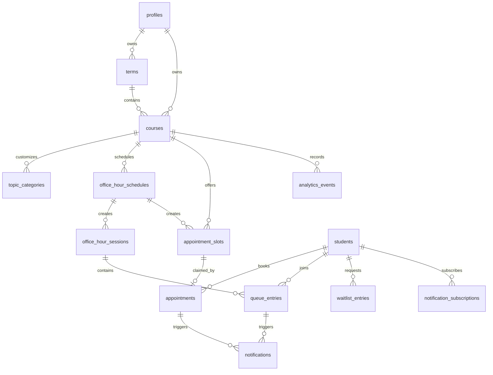

# Database

The schema is stored in `supabase/migrations/`.

## Entity relationship diagram

## Important tables

- `profiles`: professor account profile tied to Supabase Auth user.
- `terms`: academic term or semester.
- `courses`: office-hour course page with public QR slug and settings.
- `topic_categories`: course-specific topic choices.
- `office_hour_schedules`: recurring schedule pattern.
- `office_hour_sessions`: specific live office-hour session.
- `appointment_slots`: available/booked/cancelled time slots.
- `appointments`: student appointment record and private status token.
- `queue_entries`: live walk-in queue entries and private status token.
- `students`: contact records scoped to one professor.
- `waitlist_entries`: data model for appointment waitlist claims.
- `notification_subscriptions`: opening-alert subscriptions.
- `notifications`: operational notification log.
- `analytics_events`: event stream for future analytics expansion.
- `audit_logs`: administrative changes where useful.

## Race condition handling

`book_appointment_slot` uses `SELECT ... FOR UPDATE` on the chosen slot. It checks that the slot is still `available`, inserts the appointment, and updates the slot to `booked` inside one database function. A partial unique index also prevents more than one active appointment from claiming the same slot.

`join_live_queue` locks the session, checks capacity, prevents duplicate active entries for the same student/session, then assigns the next position.

## Fresh setup

1. Create a Supabase project.
2. Open Supabase SQL Editor.
3. Run `supabase/migrations/0001_initial_schema.sql`.
4. Run `supabase/migrations/0002_security_policies.sql`.
5. Copy `.env.example` to `.env.local` and fill in Supabase keys.
6. Run `npm run db:seed` for demo data.
